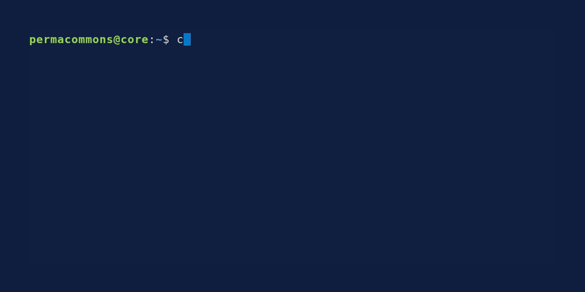

# ccd - Change Change Directory

A fast, intelligent directory navigation tool that uses the `locate` database to quickly find and change to directories. Features frequency tracking and an interactive TUI for easy directory selection.

`ccd-pick` uses a shell wrapper function to change the directory to the one you select. `ccd-pick --install` installs it in `~/.bashrc` for you.



## Features

- **Fast search**: Uses the `locate` database for instant directory lookup
- **Interactive mode**: Beautiful TUI interface for browsing and selecting directories
- **Bookmarking**: Quickly add a directory to the "frequently used" list
- **Frequency tracking**: Remembers and prioritizes frequently used directories selected via the TUI
- **Smart sorting**: Results sorted by usage frequency, then by path length
- **Keyboard navigation**: Full keyboard support for easy navigation
- **Safe installation**: Automated installer with backup and update support
- **Shell integration**: Properly changes the current shell's working directory

## Installation

### Quick Install

1. Install the Rust binary to your PATH:

   ```bash
   cargo install ccd-pick
   ```

   Or, to build and install from the repository:

   ```bash
   cargo install --path . --locked
   ```

2. Ensure `~/.cargo/bin` is in your PATH (add to ~/.bashrc if needed):
   ```bash
   export PATH="$HOME/.cargo/bin:$PATH"
   ```

3. Install the shell function to your ~/.bashrc:
   ```bash
   ccd-pick --install
   ```

4. Reload your shell configuration:
   ```bash
   source ~/.bashrc
   ```

The `ccd-pick` search functionality will only work if `locate` is installed and working, and the
`locate` index is up-to-date. It is typically provided via the `plocate` package, which replaces
the older `mlocate`, and the underlying database is usually regularly updated in the background
via the `updatedb` command.

### Manual Installation

If you prefer manual installation, you can get the shell function and add it manually:
```bash
# Print the shell function
ccd-pick --printfn > ccd_function.sh

# Add this to your ~/.bashrc or ~/.zshrc
source /path/to/ccd_function.sh
```

## Usage

### Interactive Mode (Recommended)
```bash
# Launch interactive directory picker
ccd
```

**Interactive Mode Controls:**
- Type to search for directories
- `Tab`: Toggle between search mode and frequent directories view
- `↑/↓`: Navigate through results
- `PgUp/PgDn`: Fast navigation (10 items at a time)
- `Home/End`: Jump to first/last result
- `Enter`: Select directory and change to it
- `Shift+Delete`: Reset frequency count for selected directory
- `Esc`: Quit without changing directory

**Search Mode:**
- Type to search directories using the locate database
- Results sorted by frequency, then by path length

**Frequent Mode:**
- Press `Tab` to view your most frequently used directories
- Shows directories sorted by usage count (most used first)
- Press `Tab` again to return to search mode


### Direct Search
```bash
# Change to best match for "proj"
ccd proj

# Show help
ccd --help
```

## How it works

### Frequency Tracking
- Each time you select a directory in the TUI, its usage count is incremented
- If you feel lucky via `ccd <search>`, the count is _not_ incremented. This is to avoid tracking poor matches.
- Frequently used directories appear at the top of search results
- You can reset frequency counts using the `Shift+Delete` key in interactive mode
- Frequency data is stored in `~/.ccd_frequency`

### Search Process
1. The `ccd-pick` binary searches the locate database using `locate --limit 100 <pattern>`
2. Filters results to show only directories
3. Loads frequency data from `~/.ccd_frequency`
4. Sorts results by usage frequency (most used first), then by path length
5. In direct mode: changes to the first directory found
6. In interactive mode: presents a TUI for selection


### Shell Integration
The tool uses a shell function wrapper (`ccd`) that calls the Rust binary (`ccd-pick`) and properly changes the current shell's directory. The binary outputs the target directory path, and the shell function captures this and executes `cd`.

## Examples

### Interactive Mode
```bash
$ ccd
# Opens TUI interface - type "proj" to search
# Use arrow keys to navigate, Enter to select
```

### Direct Mode
```bash
$ ccd tmp
Changed to: /tmp

$ ccd nonexistent
Searching for directories matching: nonexistent
No directories found matching 'nonexistent'
```

## Requirements

- **Rust** (for building the binary)
- **locate** command (usually part of `plocate` package)
- **Updated locate database** (`sudo updatedb`)
- **Bash** (for the shell wrapper)

## Project Structure

- `src/main.rs` - Main Rust application (`ccd-pick` binary)
- `ccd.sh` - Shell wrapper function (compiled into binary)
- `build.rs` - Build script for compiling shell function
- `Cargo.toml` - Rust project configuration

## Development

### Building
```bash
# Debug build
cargo build

# Release build
cargo build --release

# Install to ~/.cargo/bin
cargo install --path . --locked
```

## Contributing

See [AGENTS.md](AGENTS.md) for contribution guidelines. We welcome contributions from both humans and AI assistants!

## License

This project is open source. Please see the license file for details.
